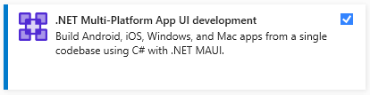
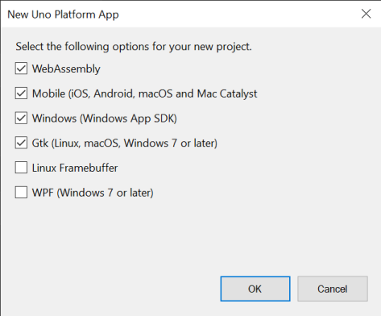

# Get Started on Visual Studio 2022

> This section is covering releases of .NET 6 and Visual Studio 2022. It is a work in progress.

## Prerequisites
1. To create Uno Platform applications you will need [**Visual Studio 2022 17.3 (Preview)**](https://visualstudio.microsoft.com/vs/preview/):
1. **Universal Windows Platform** workload installed.

    

1. **.NET Multi-platform App UI development** workload installed.

    

1. **.NET desktop development** workload installed.

    

1. **ASP**.**NET and web** workload installed, along with .NET 6.0 (for WebAssembly development)

    

> For information about connecting Visual Studio to a Mac build host to build iOS apps, see [Pairing to a Mac for Xamarin.iOS development](https://docs.microsoft.com/en-us/xamarin/ios/get-started/installation/windows/connecting-to-mac/).

## Finalize your environment setup using uno-check
* Install the uno-check tool by launching a powershell commmand line and type:
   ```
   dotnet tool install -g Uno.Check
   ```
* Then run the uno-check tool:
   ```
   uno-check --pre
   ```

Follow the steps indicated by the tool.

## Install the Uno Platform Solution Templates with Visual Studio

1. Launch Visual Studio 2022, then click `Continue without code`. Click `Extensions` -> `Manage Extensions` from the Menu Bar.

    

2. In the Extension Manager expand the **Online** node and search for `Uno`, install the <code>Uno Platform Solution Templates</code> extension or download it from the [Visual Studio Marketplace](https://marketplace.visualstudio.com/items?itemName=unoplatform.uno-platform-addin-2022), then restart Visual Studio.

    

## Create an application

> .NET 6 Mobile support is currently in Preview, following Microsoft's support status. As of Uno 4.3, .NET 6 Mobile RC 3 and above is supported with [Visual Studio 2022 17.3 Preview 1](https://visualstudio.microsoft.com/vs/preview). Previous releases of Visual Studio are not supported.

### Prerequisite
To create an Uno Platform app:
1. Create a new C# solution using the **Uno Platform App (Preview)** template, from Visual Studio's **Start Page**
1. Choose the list of targets platforms you want to be generated
   
    

1. Wait for the projects to be created, and their dependencies to be restored

1. To run for iOS:
    - Set the `MyApp.Mobile` as startup project
    - In the "Debug toolbar" drop down, select framework `net6.0-ios`
    - Select an active device
1. To debug the Android platform:
    - In the "Debug toolbar" drop down, select framework `net6.0-android`
    - Select an active device in "Device" sub-menu
1. To debug the Windows head:
    - Select the `Debug|x86` configuration
    - Debug the project
1. To run the WebAssembly (Wasm) head:
   - Select **IIS Express** and press **Ctrl+F5** or choose 'Start without debugging' from the menu.

> Debugging either the macOS and macCatalyst targets is not supported from Visual Studio on Windows.

### Troubleshooting Visual Studio and Uno Platform Installation Issues

You may encounter installation and/or post-installation Visual Studio issues for which workarounds exist. Please see [Common Issues](https://platform.uno/docs/articles/get-started-wizard.html) we have documented.

### Getting Help
If you continue experiencing issues with Visual Studio and Uno Platform, please visit our [Discord](https://www.platform.uno/discord) - #uno-platform channel or [GitHub Discussions](https://github.com/unoplatform/uno/discussions) where our engineering team and community will be able to help you. 
